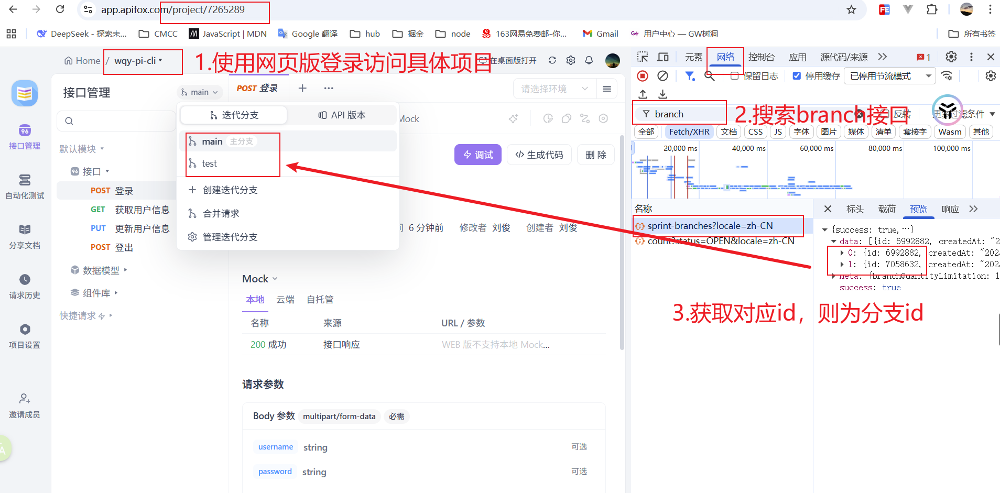

# Apifox Mock Generator

[](https://www.npmjs.com/package/apifox-mock-generator)

从 Apifox 拉取 API 接口并生成本地 Mock 数据和 TypeScript 类型文件的 npm 包。

## ✨ 功能特性

### 核心功能

- 🚀 **Apifox 集成** - 自动从 Apifox 项目拉取 API 接口定义（支持 OpenAPI 3.0）
- 📝 **类型生成** - 生成 TypeScript 类型文件（.ts 格式），支持复杂类型、嵌套对象、枚举等
- 🎭 **Apifox Mock** - **✨ 直接使用 Apifox 的 mock 规则**，无需本地配置，完全继承 Apifox 的数据生成能力
- 🌐 **Mock 服务器** - 基于 Express 的本地 Mock 服务，快速响应，支持 CORS
- 🎯 **灵活切换** - 支持接口精细控制 Mock/Proxy 模式
- 🔄 **动态代理** - 通过页面 URL 参数快速切换后端环境，无需修改配置

## 📦 安装

在你的任意前端项目中安装：

```bash
pnpm add apifox-mock-generator -D
或
pnpm add apifox-mock-generator -D -W
```

## 🚀 快速开始

### 1. 创建配置文件

**创建 Apifox 配置文件** - 用于 API 文档同步和 Mock 数据生成：

在你的项目根目录创建 `apifox.config.json`：

```json
{
  "projectId": "7219799",
  "token": "APS-XQrLSqLE4q0FOb0bGhaqYvTxSUQQFPeO",
  "mockDir": "./mock",
  "typesDir": "./src/types/mock",
  "generate": "all",
  "apiFilter": {
    "scope": {
      "excludedByTags": ["设计中", "已废弃"],
      "folderPaths": []
    },
    "includePaths": [],
    "excludePaths": [],
    "includeMethods": []
  }
}
```

**创建 Mock 服务器配置文件** - 用于控制 Mock 服务器运行时行为：

创建 `mock.config.js`：

```javascript
/**
 * Mock 服务器配置文件
 */

export default {
  // 工作模式：'proxy', 'mock'，访问服务器或者访问本地数据。可以在query中写入\$_mock，\$_proxy定义单个请求
  model: 'proxy',
  // 是否开启https
  https: false,
  // 本地服务的端口
  port: 10000,
  // 默认代理至系统测试环境, 请配置本地host
  target: 'http://172.24.7.99:8082',
  // 开始remote参数, 通过url中remote=xxx来代理多个后端地址, 需要mock直接在url中设置remote=mock即可
  remoteTarget: true,
  // 按接口粒度控制 Mock/Proxy（可选）
  mockRoutes: [
    // 示例：这些接口强制使用本地 Mock
    // '/auth/login',
    // 'GET /user/info'
  ],
  proxyRoutes: [
    // 示例：这些接口强制直连后端
    // 'POST /payment/pay',
    // '/config/remote'
  ]
};
```

### 2. 配置 package.json 脚本

```json
{
  "scripts": {
    "auto-mock": "apifox-mock generate",
    "mock": "apifox-mock serve"
  }
}
```

### 3. 生成 Mock 和类型文件

```bash
pnpm auto-mock
```

### 4. 启动 Mock 服务器

```bash
pnpm mock
```

### 5. 配置代理（Vite 项目）

在 `vite.config.ts` 中：

```typescript
export default defineConfig({
  server: {
    proxy: {
      '/api': {
        target: 'http://localhost:10000', // 指向 Mock 服务器端口(10000为mock.config.js 中的port)
        changeOrigin: true,
        rewrite: path => path.replace(/^\/api/, '')
      }
    }
  }
});
```

### 6. 使用生成的类型

```typescript
import type { DatamaskRuleAddPost } from './src/types/api/auth/login';

const login = async (
  data: DatamaskRuleAddPost.ReqData
): Promise<DatamaskRuleAddPost.Res> => {
  const response = await fetch('/api/auth/login', {
    method: 'POST',
    body: JSON.stringify(data)
  });
  return response.json();
};
```

## 🔧 配置说明

本项目使用两个配置文件来管理不同的功能：

### 📋 配置文件作用

**1. `apifox.config.json`** - API 文档同步配置

- **作用**：配置 Apifox 项目信息和生成路径
- **功能**：负责从 Apifox 同步 API 文档，生成 Mock 数据和 TypeScript 类型定义
- **使用时机**：运行 `pnpm auto-mock` 时使用

**2. `mock.config.js`** - Mock 服务器运行时配置

- **作用**：配置 Mock 服务器的运行时行为
- **功能**：控制服务器端口、工作模式、代理目标等
- **使用时机**：运行 `pnpm mock` 时使用

### apifox基础配置

- `projectId`: Apifox 项目 ID（在项目设置中查看）
- `token`: Apifox API Token（在账号设置中生成, 需账号在当前项目中有管理员及以上权限）
- `branchId`: 项目分支名称（number类型，有key则必须有值）
- `apiUrl`: Apifox API 基础 URL（可选，默认：`https://api.apifox.com`）。用于自定义 Apifox API 服务器地址，适用于私有部署或内网环境
- `mockDir`: Mock 文件生成目录（默认：`./mock`）
- `typesDir`: TypeScript 类型文件生成目录（默认：`./src/types/mock`）
- `generate`: 生成范围（可选，默认 `all`）。可选值：
  - `all` 同时生成 Mock 与 TS 类型
  - `mock` 只生成 Mock 文件
  - `types` 只生成 TS 类型
- `apiFilter`: API 筛选配置（可选）

#### branchId 获取方法



#### API 筛选配置

通过 `apiFilter` 配置项，您可以精确控制需要导出和生成的 API 接口。

**`scope` 配置** - 导出范围配置：

| 参数             | 类型       | 说明                                                             |
| ---------------- | ---------- | ---------------------------------------------------------------- |
| `includedByTags` | `string[]` | 包含的标签列表                                                   |
| `excludedByTags` | `string[]` | 排除的接口状态（支持中文：`设计中`、`已废弃`、`待确定` 等）      |
| `folderPaths`    | `string[]` | 文件夹路径列表（支持多个中文文件夹名称匹配，支持前缀匹配子目录） |

**其他过滤配置**：

| 参数             | 类型       | 说明                                      |
| ---------------- | ---------- | ----------------------------------------- |
| `includePaths`   | `string[]` | 只包含这些路径（支持 `*` 和 `**` 通配符） |
| `excludePaths`   | `string[]` | 排除这些路径（支持 `*` 和 `**` 通配符）   |
| `includeMethods` | `string[]` | 只包含这些 HTTP 方法                      |
| `excludeMethods` | `string[]` | 排除这些 HTTP 方法                        |

### Mock 服务器配置

**配置文件**：`mock.config.js`  
**主要作用**：控制 Mock 服务器的运行时行为，包括端口、工作模式、代理目标等

通过 `mock.config.js` 配置文件，您可以灵活配置 Mock 服务器的行为，支持多种工作模式和动态配置。

#### 配置选项说明

| 参数           | 类型                 | 默认值  | 说明                                                    |
| -------------- | -------------------- | ------- | ------------------------------------------------------- |
| `model`        | `string`             | `mock`  | 工作模式：`mock`（本地数据）或 `proxy`（代理到远程）    |
| `https`        | `boolean`            | `false` | 是否开启 HTTPS                                          |
| `port`         | `number`             | `10000` | Mock 服务器端口                                         |
| `target`       | `string`             | -       | 远程服务器目标地址（代理模式使用）                      |
| `remoteTarget` | `boolean`            | `true`  | 是否支持页面 URL 参数控制（`?remote=mock/https://xxx`） |
| `pathPrefixes` | `string \| string[]` | -       | 请求路径前缀（用于处理生成路径与真实请求的前缀差异）    |
| `mockRoutes`   | `string[]`           | `[]`    | 强制使用 Mock 的路由列表（可选）                        |
| `proxyRoutes`  | `string[]`           | `[]`    | 强制使用 Proxy 的路由列表（可选）                       |

#### 工作模式说明

**1. Mock 模式（默认）**

- 优先返回本地生成的 Mock 数据
- 适合前端开发阶段

**2. Proxy 模式**

- 所有请求转发到 `target` 指定的远程服务器
- 适合联调阶段

**3. 页面级控制（推荐）**

- 通过页面 URL 的 `?remote` 参数控制所有接口：
  - `?remote=mock` - 所有接口使用 Mock 数据
  - `?remote=https://api.test.com` - 所有接口代理到指定地址
  - 无需修改每个接口调用，自动从 Referer 识别

**4. 按接口粒度控制**

通过 `mockRoutes` 和 `proxyRoutes` 配置实现精细控制：

```javascript
// mock.config.js
export default {
  model: 'proxy', // 联调环境默认直连
  port: 10000,
  target: 'http://api.dev.company.com',
  remoteTarget: true,

  // 这些接口强制使用 Mock（即使 model='proxy'）
  mockRoutes: [
    '/auth/login', // 匹配所有方法
    'GET /user/info' // 只匹配 GET 方法
  ],

  // 这些接口强制直连后端（即使 model='mock'）
  proxyRoutes: ['POST /payment/pay', '/health']
};
```

**优先级规则：**

```
页面 remote > mockRoutes/proxyRoutes > model
```

### ⚠️ 重要配置说明

#### 1. Prettier 忽略配置

**需要将 `mock` 文件夹添加到 `.prettierrc` 的忽略文件中**，主要原因是格式化文件会影响 Mock.js 语法。

在项目根目录创建或更新 `.prettierignore` 文件：

```bash
# .prettierignore
mock/
```

#### 2. Mock 目录配置

**⚠️ 重要：`"mockDir": "./mock"` 不要更改**，因为 Mock 服务会去项目目录下查找 `mock` 文件。

- Mock 服务器启动时会自动扫描项目根目录下的 `mock/` 文件夹
- 如果修改了 `mockDir` 路径，可能导致 Mock 服务无法正确加载数据
- 建议保持默认配置：`"mockDir": "./mock"`

### MockPort、Target 和 Vite Proxy 的关系

理解这三个配置项的关系对于正确配置开发环境非常重要：

#### 配置关系图

```
前端应用 (Vite Dev Server)
    ↓ (API 请求 /api/v1/xxx)
Vite Proxy 配置
    ↓ (转发到 mockPort)
Mock 服务器 (mockPort: 10000)
    ↓ (根据 model 配置)
├─ Mock 模式: 返回本地数据
└─ Proxy 模式: 代理到 target
     ↓
真实后端服务器 (target: http://xxx.com)
```

#### 数据流向说明

1. **前端请求**: `http://localhost:5173/api/v1/user/info`
2. **Vite 代理**: 转发到 `http://localhost:10000/v1/user/info`
3. **Mock 服务器**: 根据 `model` 配置决定：
   - `model: 'mock'`: 返回本地生成的 Mock 数据
   - `model: 'proxy'`: 代理到 `http://localhost:8080/v1/user/info`

### 🎭 Apifox Mock 规则

#### 工作原理

1. **在 Apifox 中配置** - 为每个字段设置 mock 规则（支持 Mock.js 语法和 Apifox 模板语法）
2. **自动拉取规则** - 工具自动从 Apifox 导出的 OpenAPI 数据中提取 mock 规则
3. **智能转换** - 自动将 Apifox 模板语法（如 `{{$string.uuid}}`）转换为 Mock.js 语法（如 `@guid`）
4. **生成 Mock 文件** - 工具自动提取并转换 Apifox 的 mock 规则，生成本地 Mock 文件

#### 回退策略

如果字段没有配置 Apifox mock 规则，会使用以下回退策略：

1. **示例值** - 使用 schema 中定义的 `example`（字段示例值）
2. **枚举值** - 使用 `enum` 中的值（通过 `@pick` 随机选择）
3. **基本规则** - 根据字段类型使用简单的默认规则（如字符串用 `@cword(3,8)`）

### 自定义 Mock 数据

修改生成的 Mock 文件（如 `mock/api/auth/login.js`）：

```javascript
export default {
  method: 'POST',
  path: '/api/auth/login',
  response: {
    code: 0,
    message: 'success',
    data: {
      token: 'custom-token-12345', // 自定义数据
      userId: 10086
    }
  }
};
```

> ⚠️ 注意：重新运行 `apifox-mock generate` 会覆盖自定义的修改

## 🔄 工作流程

作为 npm 包安装到你的项目中，工作模式如下：

```
┌─────────────────────────────────────────────────────────────┐
│                 你的前端项目 (如 Vue)                        │
├─────────────────────────────────────────────────────────────┤
│                                                              │
│  ┌──────────────────────────────────────────────────────┐  │
│  │  Apifox 平台                                          │  │
│  │  OpenAPI 数据                                         │  │
│  └───────────────┬──────────────────────────────────────┘  │
│                  │ ① 拉取 API                              │
│                  ↓                                          │
│  ┌──────────────────────────────────────────────────────┐  │
│  │  apifox-mock-generator (npm 包)                      │  │
│  │  • apifox-mock generate  - 生成文件                  │  │
│  │  • apifox-mock serve     - 启动服务器                │  │
│  └───────────────┬──────────────────────────────────────┘  │
│                  │ ② 生成                                  │
│                  ↓                                          │
│  ┌──────────────────────────────────────────────────────┐  │
│  │  配置文件                                             │  │
│  │  • apifox.config.json - API 生成配置                 │  │
│  │  • mock.config.js     - Mock 服务器配置              │  │
│  └───────────────┬──────────────────────────────────────┘  │
│                  │ ③ 生成                                  │
│                  ↓                                          │
│  ┌──────────────────────────────────────────────────────┐  │
│  │  生成的文件                                           │  │
│  │  • mock/        - Mock 数据文件                      │  │
│  │  • src/types/mock/ - TypeScript 类型                  │  │
│  └──────┬───────────────────────────────────────────┬───┘  │
│         │                                            │      │
│         │ ④ 导入类型                                 │ ⑤ HTTP 请求
│         ↓                                            ↓      │
│  ┌─────────────────┐                  ┌─────────────────┐  │
│  │  前端代码       │    Vite Proxy    │  Mock 服务器    │  │
│  │ (localhost:3000)│ ─────────────>  │ (localhost:10000)│  │
│  │                 │  /api/**         │                 │  │
│  │  • 业务逻辑     │                  │  • 工作模式切换 │  │
│  │  • API 调用     │  <─────────────  │  • Mock/Proxy   │  │
│  │  • TS 类型      │   响应数据       │  • 热重载       │  │
│  └─────────────────┘                  └─────────┬───────┘  │
│                                                  │          │
│                                                  │ ⑥ 代理   │
│                                                  ↓          │
│                                            ┌─────────────┐  │
│                                            │ 真实后端    │  │
│                                            │ (target)    │  │
│                                            └─────────────┘  │
└─────────────────────────────────────────────────────────────┘
```

## ⚠️ 已知限制

当前版本暂不支持以下特性：

- ⚠️ OpenAPI 2.0 (Swagger) - 仅支持 OpenAPI 3.0
- ⚠️ 文件上传/下载类型
- ⚠️ WebSocket 协议
- ⚠️ GraphQL

## 💡 常见问题

### 1. 拉取 API 失败？

检查：

- `projectId` 和 `token` 是否正确
- Token 是否有「项目维护者」或「管理员」权限
- 网络连接是否正常

### 2. 端口被占用？

修改 `mock.config.js` 中的 `port` 配置。

### 3. 没有生成任何文件？

检查：

- `apiFilter` 筛选规则是否过于严格
- Apifox 项目中是否有匹配的接口
- 查看终端输出的错误信息
- 确认 Apifox Token 是否有正确的权限

### 4. 类型生成不准确？

建议：

- 在 Apifox 中完善接口的类型定义，枚举等需要通过字段的高级设置才有效
- 为每个字段添加描述和示例

### 5. 热重载不生效？

确认：

- Mock 文件保存成功
- 查看终端是否有文件变化的提示
- 检查文件路径是否在 `mockDir` 配置的目录下

### 6. 启动 Mock 服务器失败？

检查以下条件：

- ✅ **配置文件存在** - 确保 `apifox.config.json` 在项目根目录
- ✅ **Mock 目录存在** - 确保 `mock/` 目录存在且不为空
- ✅ **Mock 文件已生成** - 先运行 `pnpm auto-mock` 生成 Mock 文件
- ✅ **端口未被占用** - 检查 `mock.config.js` 中 `port` 配置的端口是否可用

常见错误及解决方案：

```bash
# 错误：未找到 apifox.config.json 配置文件
# 解决：创建配置文件

# 错误：未找到 Mock 目录
# 解决：先生成 Mock 文件
pnpm auto-mock

# 错误：未找到任何 Mock 文件
# 解决：检查 API 筛选配置，确保有匹配的接口
```

### 7. mockRoutes/proxyRoutes 配置不生效？

**问题现象：** 配置了 mockRoutes 或 proxyRoutes 但接口没有按预期工作

**解决方案：**

1. **检查路径格式**：

   ```javascript
   // ✅ 正确格式
   mockRoutes: [
     '/auth/login', // 匹配所有方法
     'GET /user/info' // 只匹配 GET 方法
   ];

   // ❌ 错误格式
   mockRoutes: [
     'auth/login', // 缺少开头的 /
     '/user/*', // 不支持通配符
     /\/api\/.*/ // 不支持正则
   ];
   ```

2. **检查优先级**：确保没有被更高优先级的配置覆盖

   ```
   页面 remote > mockRoutes/proxyRoutes > model
   ```

3. **验证路径匹配**：路径必须完全匹配（区分大小写）

4. **重新编译**：修改配置后记得重新编译
   ```bash
   pnpm mock
   ```

### 💡 最佳实践

| 场景          | 建议                                                       |
| ------------- | ---------------------------------------------------------- |
| **配置文件**  | 首次配置好提交上库之后，apiFilter配置不提交上库            |
| **类型文件**  | 建议提交到 Git，团队共享类型定义                           |
| **Mock 数据** | apifox接口有变化时，若对应业务有调整，mock建议一并提交处理 |
| **切换环境**  | 后端完成后只需修改代理配置，代码无需改动                   |

## 📝 更新日志

详见 [CHANGELOG.md](./CHANGELOG.md) 获取完整更新日志。
