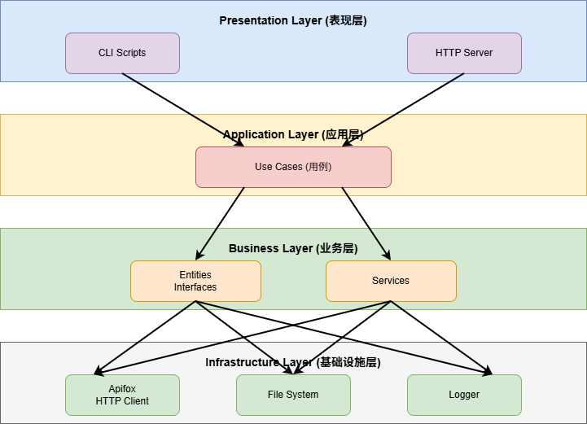
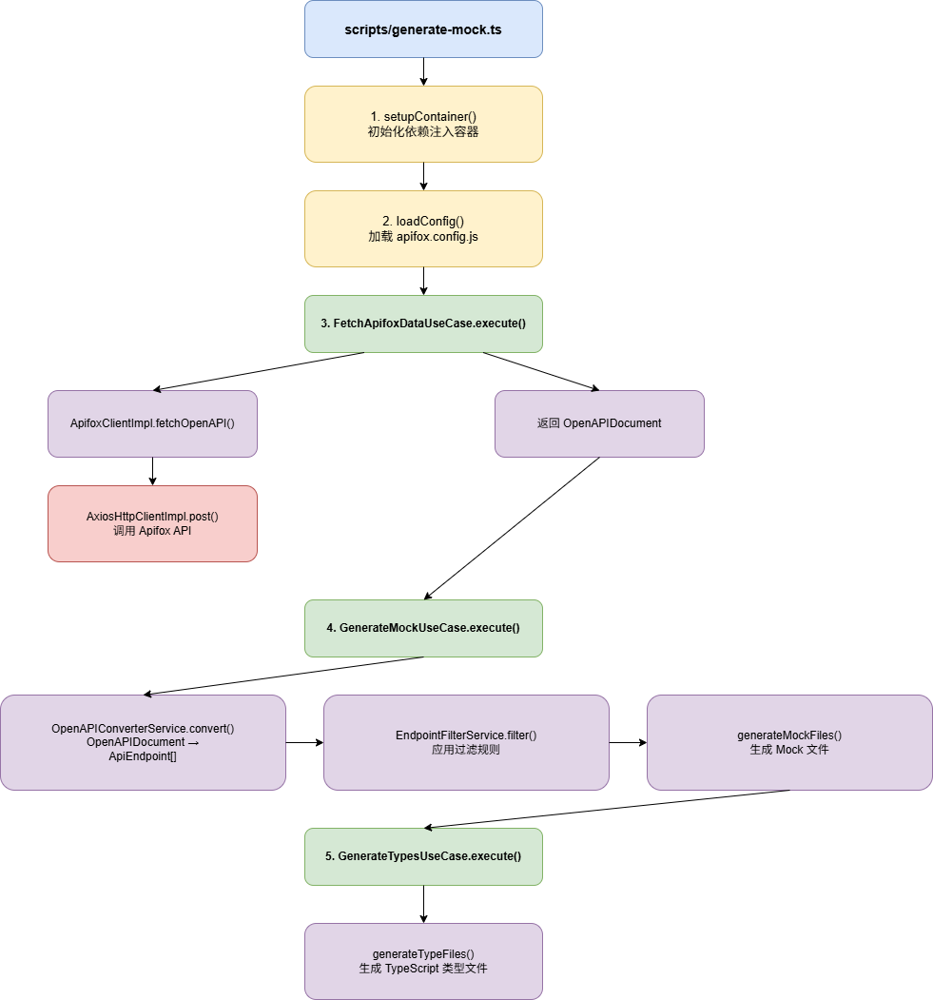
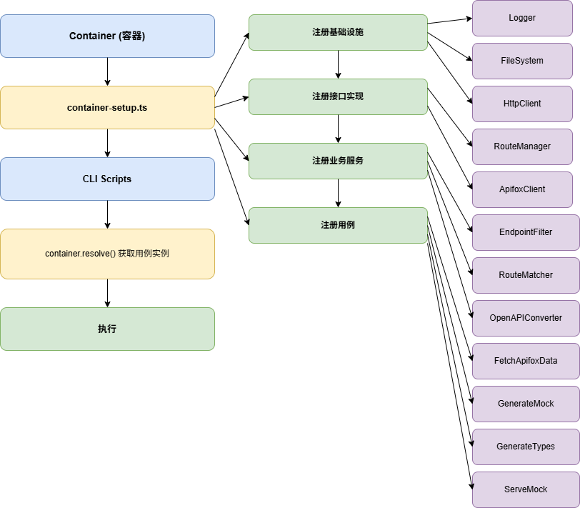

# Apifox Mock Generator 架构设计文档

## 📋 目录
1. [架构概览](#架构概览)
2. [核心模块](#核心模块)
3. [模块联动](#模块联动)
4. [主要功能](#主要功能)

---

## 🏗️ 架构概览

### 整体架构

采用**分层架构**和**依赖注入**设计，分为四层：



### 目录结构

```
src/
├── scripts/              # CLI 入口脚本
│   ├── generate-mock.ts  # 生成命令入口
│   └── serve-mock.ts     # 服务命令入口
├── core/                 # 核心基础设施
│   ├── container.ts      # 依赖注入容器
│   ├── container-setup.ts # 容器初始化
│   ├── config-loader.ts  # Apifox 配置加载
│   └── mock-config-loader.ts # Mock 配置加载
├── domain/               # 业务层
│   ├── entities/         # 业务实体（ApiEndpoint, MockRoute）
│   ├── interfaces.ts     # 接口定义（IApifoxClient, IRouteManager 等）
│   └── services/         # 业务服务
│       ├── endpoint-filter.service.ts    # 端点过滤
│       ├── route-matcher.service.ts      # 路由匹配
│       └── openapi-converter.service.ts # OpenAPI 转换
├── application/          # 应用层
│   └── use-cases/        # 用例
│       ├── fetch-apifox-data.use-case.ts
│       ├── generate-mock.use-case.ts
│       ├── generate-types.use-case.ts
│       └── serve-mock.use-case.ts
├── infrastructure/       # 基础设施层
│   ├── apifox/           # Apifox 客户端实现
│   ├── file-system/      # 文件系统实现
│   ├── http/             # HTTP 客户端实现
│   ├── logger/           # 日志实现
│   ├── route-manager/    # 路由管理器实现
│   └── server/           # 服务器相关
│       ├── route-loader.ts    # 路由加载器
│       ├── remote-proxy.ts    # 远程代理
│       └── hot-reload.ts      # 热重载
├── presentation/         # 表现层
│   └── http/            # HTTP 服务器
│       ├── express-server.ts  # Express 服务器设置
│       └── route-handler.ts   # 路由处理器
├── generators/          # 代码生成器
│   ├── mock-generator.ts      # Mock 文件生成
│   ├── type-generator.ts      # 类型文件生成
│   └── templates/             # 代码模板
└── types/               # 类型定义
```

---

## 📦 核心模块

### 1. Business Layer（业务层）

**职责**：定义业务实体、接口和核心业务逻辑，不依赖外部框架。

#### 实体（Entities）
- **ApiEndpoint**: API 端点实体，包含路径、方法、参数等信息
- **MockRoute**: Mock 路由实体，包含响应数据和验证规则

#### 接口（Interfaces）
- **IApifoxClient**: Apifox API 客户端接口
- **IRouteManager**: 路由管理器接口
- **IFileSystem**: 文件系统接口
- **ILogger**: 日志接口
- **IHttpClient**: HTTP 客户端接口

#### 业务服务（Services）
- **EndpointFilterService**: 根据配置过滤 API 端点
- **RouteMatcherService**: 匹配请求路径到 Mock 路由
- **OpenAPIConverterService**: 将 OpenAPI 文档转换为端点实体

### 2. Application Layer（应用层）

**职责**：编排用例，协调业务服务。

#### 用例（Use Cases）
- **FetchApifoxDataUseCase**: 从 Apifox 获取 OpenAPI 文档
- **GenerateMockUseCase**: 生成 Mock 文件
- **GenerateTypesUseCase**: 生成 TypeScript 类型文件
- **ServeMockUseCase**: 启动 Mock 服务器

### 3. Infrastructure Layer（基础设施层）

**职责**：实现接口，处理外部依赖。

- **ApifoxClientImpl**: 实现 Apifox API 调用
- **FileSystemImpl**: 实现文件系统操作
- **AxiosHttpClientImpl**: 实现 HTTP 请求
- **ConsoleLoggerImpl**: 实现控制台日志
- **RouteManagerImpl**: 实现路由管理
- **RouteLoader**: 动态加载 Mock 文件
- **RemoteProxy**: 代理请求到远程服务器
- **HotReload**: 监听文件变化并热重载

### 4. Presentation Layer（表现层）

**职责**：用户交互入口。

- **CLI Scripts**: 命令行脚本入口
- **Express Server**: HTTP 服务器设置
- **RouteHandler**: 根据工作模式处理请求（Mock/Proxy）

### 5. Core（核心层）

**职责**：提供基础设施支持。

- **Container**: 依赖注入容器
- **ContainerSetup**: 容器初始化，注册所有服务
- **ConfigLoader**: 加载 Apifox 配置
- **MockConfigLoader**: 加载 Mock 服务器配置

---

## 🔄 模块联动

### 1. 生成流程（Generate）



**关键文件**：
- ```1:57:src/scripts/generate-mock.ts``` - 生成命令入口
- ```13:56:src/application/use-cases/generate-mock.use-case.ts``` - Mock 生成用例

### 2. 服务流程（Serve）


**关键文件**：
- ```12:117:src/application/use-cases/serve-mock.use-case.ts``` - 服务用例
- ```14:77:src/presentation/http/route-handler.ts``` - 路由处理器
- ```29:327:src/infrastructure/server/route-loader.ts``` - 路由加载器

### 3. 依赖注入流程




**关键文件**：
- ```11:83:src/core/container.ts``` - 依赖注入容器
- ```23:130:src/core/container-setup.ts``` - 容器初始化

---

## 🎯 主要功能

### 1. 从 Apifox 生成 Mock 文件

**功能描述**：从 Apifox 项目拉取 OpenAPI 文档，生成 Mock 文件和 TypeScript 类型文件。

**工作流程**：
1. 读取 `apifox.config.js` 配置
2. 调用 Apifox API 获取 OpenAPI 文档
3. 将 OpenAPI 转换为 `ApiEndpoint` 实体
4. 应用过滤规则（includePaths/excludePaths）
5. 按路径分组，生成 Mock 文件（支持增量更新）
6. 生成 TypeScript 类型文件

**关键特性**：
- ✅ 支持路径过滤（includePaths/excludePaths）
- ✅ 支持增量更新（保留手动修改的代码）
- ✅ 自动生成文件架构和导入语句
- ✅ 支持动态 Mock 函数和静态数据

### 2. 启动 Mock 服务器

**功能描述**：启动本地 Mock 服务器，支持 Mock 模式和代理模式。

**工作模式**：

#### Mock 模式（`model: 'mock'`）
- 默认使用本地 Mock 数据
- 可通过 `proxyRoutes` 配置特定路由走代理
- 支持动态 Mock 函数

#### Proxy 模式（`model: 'proxy'`）
- 默认转发到远程服务器
- 可通过 `mockRoutes` 配置特定路由走 Mock
- 支持动态切换目标服务器（通过 URL 参数 `?remote`）

**路由匹配优先级**：
1. URL 参数 `?remote`（最高优先级）
2. `mockRoutes` / `proxyRoutes` 配置
3. `model` 全局配置（最低优先级）

**关键特性**：
- ✅ 支持路径参数匹配（如 `/user/:id`）
- ✅ 支持参数验证
- ✅ 支持热重载（修改 Mock 文件自动生效）
- ✅ 支持路径前缀处理（`pathPrefixes`）
- ✅ 支持远程目标动态切换

### 3. 路由管理

**功能描述**：动态加载和管理 Mock 路由。

**工作流程**：
1. 扫描 Mock 目录下的所有 `.js` 文件
2. 解析文件内容，提取路由信息（路径、方法、处理函数）
3. 动态导入模块，获取处理函数
4. 注册到 `RouteManager`
5. 文件变化时自动重新加载（热重载）

**关键特性**：
- ✅ 支持动态路由加载
- ✅ 支持热重载
- ✅ 支持多种函数命名方式（精确匹配、前缀匹配、default）

### 4. 代码生成

**功能描述**：根据 OpenAPI Schema 生成 Mock 数据和 TypeScript 类型。

**Mock 生成**：
- 根据 Schema 生成符合规范的 Mock 数据
- 支持嵌套对象、数组、枚举等类型
- 支持自定义 Mock 函数模板

**类型生成**：
- 生成 TypeScript 接口和类型
- 支持请求/响应类型
- 支持 Schema 引用解析

---
